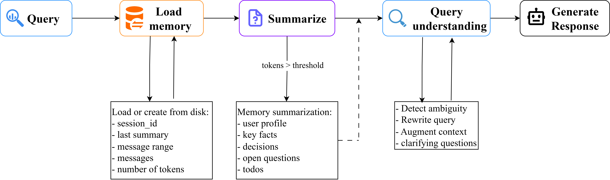

# Chat Assistant with Session Memory

A chat assistant demonstrating:
1. **Session Memory via Summarization** - Automatic summarization when conversation context exceeds a configurable token threshold
2. **Query Understanding Pipeline** - Rewriting ambiguous queries, context augmentation, and clarifying questions

## Architecture



The system follows a pipeline architecture to handle long conversations efficiently while maintaining context:

1.  **User Query**: The `AgentService` receives the user's query and the active `session_id`.
2.  **Memory Retrieval**: Loads the full conversation history and existing structured summary (if any) using the `MemoryService`.
3.  **Token Optimization (Summarization)**:
    *   The system calculates the total token count of the current session using `tiktoken`.
    *   **Trigger**: If the count exceeds the `TOKEN_THRESHOLD` (e.g., 1000 tokens), the `MemoryService` invokes an LLM to condense older messages into a structured JSON summary (User Profile, Key Facts, Decisions, etc.).
    *   The memory is then updated to retain only the summary and the most recent messages, effectively resetting the context window size.
4.  **Query Understanding Pipeline**:
    *   **Analysis**: The `QueryService` examines the user's input alongside recent history to detect ambiguities.
    *   **Rewriting**: Ambiguous queries are rewritten to be self-contained (e.g., changing "it" to specific nouns).
    *   **Augmentation**: The final prompt is enriched with relevant context extracted from the session summary.
5.  **Response Generation**: The augmented context and refined query are sent to the LLM to generate the final answer.
6.  **State Persistence**: The new interaction is appended to the session log, and the updated state is saved to the JSON storage.

## Features

### A. Session Memory via Summarization
- **Trigger**: When conversation context exceeds configurable threshold (default: 1k tokens)
- **Token Counting**: Uses `tiktoken` with `o200k_base` model
- **Output Schema**:
```json
{
  "session_summary": {
    "user_profile": {"preferences": [], "constraints": []},
    "key_facts": [],
    "decisions": [],
    "open_questions": [],
    "todos": []
  },
  "message_range_summarized": {"from": 0, "to": 10}
}
```

### B. Query Understanding Pipeline
1. **Rewrite/Paraphrase**: Detect and rewrite ambiguous queries
2. **Context Augmentation**: Combine recent messages + session memory
3. **Clarifying Questions**: Generate 1-3 questions if intent unclear

**Output Schema**:
```json
{
  "original_query": "...",
  "is_ambiguous": true,
  "rewritten_query": "...",
  "needed_context_from_memory": ["user_profile.preferences", ...],
  "clarifying_questions": ["...", "..."],
  "final_augmented_context": "..."
}
```

## Project Structure

```
backend/
├── app.py                      # FastAPI application
├── demo.py                     # Demo script for both flows
├── data/
│   ├── memory/                 # Session memory storage (JSON files)
│   └── test_conversations/     # Test data 
└── src/
    ├── config.py               # Configuration (token threshold, etc.)
    ├── schemas/
    │   └── chat.py             # Pydantic schemas (SessionSummary, QueryUnderstanding)
    ├── services/
    │   ├── agent_service.py    # Main chat pipeline
    │   ├── memory_service.py   # Session memory with summarization
    │   └── query_service.py    # Query understanding pipeline
    └── routers/
        └── agent.py            # API endpoints

frontend/
└── src/app/page.tsx            # React chat interface
```

## Setup

### Requirements

- **Python**: 3.10 or higher
- **Node.js**: 22.19 or higher

### Environment Configuration
```bash
# Copy the environment template file
cp .env.example .env

# Edit .env with your actual values
- OPENAI_API_KEY: Your OpenAI API key
- OPENAI_MODEL: OpenAI model to use (e.g., gpt-4.1-mini)
- NEXT_PUBLIC_BACKEND_URL: Backend server URL (default: http://localhost:8000)
- NEXT_PUBLIC_BACKEND_API_KEY: Backend API key for frontend
```

### Backend
```bash
cd backend

# Create and activate conda environment
conda create -n shortmem python=3.10
conda activate shortmem

# Install dependencies
pip install -r requirements.txt

# Run server
uvicorn app:app --reload
```

### Frontend
```bash
cd frontend
npm install
npm audit fix
npm run dev
```

## Demo

- Run the app and send queries from `backend/data/test_conversations` to see the UI (context size increasing, summarization being triggered, generated summary), or run `backend/demo.py` for a quick demonstration.
- View memory logs, conversation log and chat history in the `backend/data/memory` folder.
- Memory trigger (summarize) demo:

<video src="docs/memory_trigger.mp4" controls="controls" style="max-width: 100%; height: auto;">
  Your browser does not support the video tag.
</video>

- Ambiguous query:

- Context aware:

## API Endpoints

- `POST /api/v0/chat/` - Main chat endpoint (streaming response)
- `GET /api/v0/chat/session/{session_id}` - Get session memory
- `DELETE /api/v0/chat/session/{session_id}` - Clear session memory
- `GET /api/v0/health/` - Health check

## Configuration

Edit `backend/src/config.py`:

```python
TOKEN_THRESHOLD: int = 1000      # Trigger summarization threshold
TIKTOKEN_MODEL: str = "o200k_base" # Token counting model
RECENT_MESSAGES_COUNT: int = 5    # Messages to keep after summarization
```
